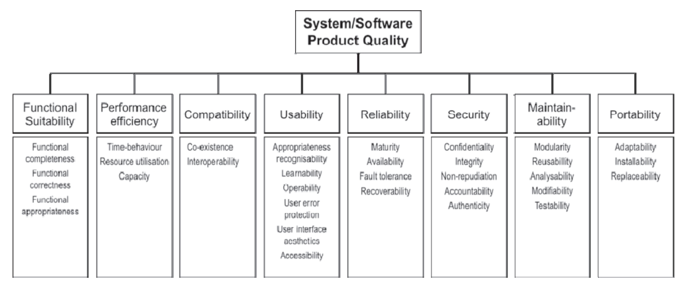

# 4. Modelo de Qualidade

O modelo adotado é o `Modelo de Qualidade do Produto SQuaRE (ISO/IEC 25010)`, conforme ilustrado na Tabela F1-3. O modelo de qualidade do produto originalmente categoriza as propriedades de qualidade do produto de software em oito características: adequação funcional, eficiência de desempenho, compatibilidade, usabilidade, confiabilidade, segurança, manutenibilidade e portabilidade. Cada característica é composta por um conjunto de subcaracterísticas relacionadas.

<figure align="center">
   
   <figcaption>Autor: Lucas</figcaption>
</figure>

*Tabela F1-3: Diagrama Qualidade de Produto. Fonte: Norma ISO/IEC 25010*

## 4.1 Adaptação do Modelo e Justificativas de Exclusão
Adaptamos o modelo para focar na `Visão do Produto e do Usuário`.

* **Justificativa de exclusão da visão de Manufatura:** O escopo desta disciplina foca na avaliação do produto de software "pronto" ou em release funcional (artefatos de código, pipelines, interface), e não no processo de fábrica de software, gestão de maturidade (CMMI) ou governança de equipe.
* **Justificativa de exclusão da Usabilidade:** Embora crítica para plataformas web, a avaliação optou por focar nos riscos sistêmicos estruturais (ausência de backend dedicado). Para o contexto acadêmico crítico (períodos de matrícula, editais), garantir a veracidade dos arquivos JSON e que o GitHub Pages não falhe possui prioridade técnica sobre a validação ergonômica da interface nesta etapa específica.

Então, selecionamos as características desejadas por meio da fórmula: `Prioridade = Peso × (Impacto × Risco)`. Isso permite focar nos riscos críticos da persona, evitando avaliações de subcaracterísticas de baixo valor para o nosso objetivo. Falaremos mais sobre a escolha e priorizações no próximo tópico.

Assim, para esta avaliação foram selecionadas as seguintes características:

**SQuaRE (ISO/IEC 25010)**

1.  **Confiabilidade (Reliability):** Define o grau em que o sistema executa funções específicas sob condições estabelecidas por um período de tempo.
2.  **Segurança (Security):** Fundamental para proteger os dados e as informações contra acessos e modificações não autorizadas.

## 4.2. Diagrama Adaptado (visão geral)
A Tabela F1-4, abaixo, foca na hierarquia das qualidades selecionadas para o Mural UnB:

<figure align="center">
   
</figure>

*Tabela F1-4: Diagrama Qualidade de Produto. Autor: Lucas*