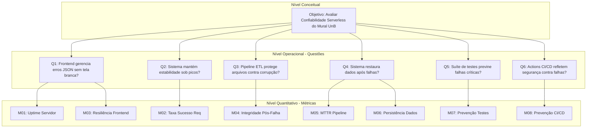
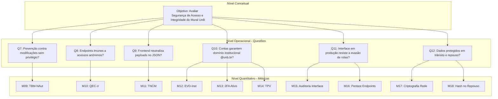

# 4. Hierarquia GQM (Diagramas) e Tabela de Estrutura Hierárquica GQM

O fluxograma abaixo evidencia visualmente a coesão entre as métricas e atributos em uma única estrutura GQM. A seguir, estão as representações gráficas completas e equivalentes para as duas ramificações.

## Diagrama 1: Hierarquia GQM — Confiabilidade

## Diagrama 2: Hierarquia GQM — Segurança

## Tabela F2-3: Estrutura Hierárquica GQM

Para garantir a precisão da avaliação, utilizamos a abordagem GQM. A `Tabela F2-3` resume a estratégia estruturada tanto para Confiabilidade quanto para Segurança.

| Característica | Objetivo (Goal) | Questão (Question) | Métrica (Metric) |
| :---: | :---: | :---: | :---: |
| **Confiabilidade** | Maximizar a disponibilidade da SPA Jamstack. | Qual a taxa de sucesso do build e deploy via GitHub Pages? | Porcentagem de Actions executadas com sucesso vs. falhas. |
| **Confiabilidade** | Assegurar tolerância a falhas na busca. | O app quebra caso falte um vetor JSON? | Quantidade de exceções não tratadas no front-end ao carregar Oportunidades DB.json. |
| **Segurança** | Proteger a Integridade dos dados de oportunidades. | O pipeline ETL possui salvaguardas contra arquivos mal formatados? | Taxa de rejeição de arquivos PDF não padronizados no Data Handler. |
| **Segurança** | Garantir Autenticidade no controle do repositório. | Apenas mantenedores aprovados podem alterar os JSONs em main? | Quantidade de regras de proteção de branch (branch protections) ativadas no repositório. |

*Tabela F2-3: Estrutura Hierárquica GQM*