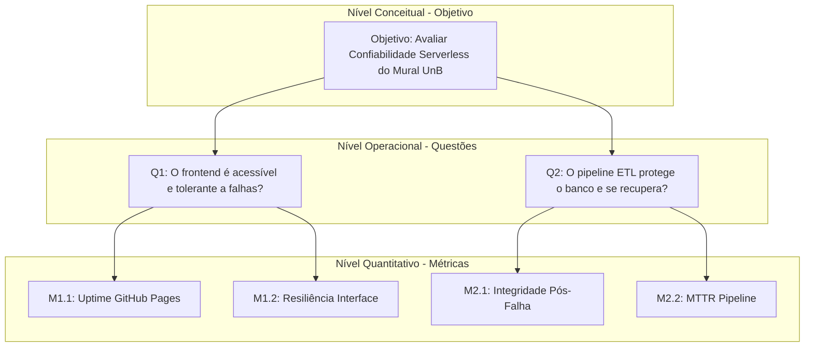

Tem q melhorar umas coisas ainda, glossário daqui, acho q as métricas fazem sentido mas precisava melhorar a parte dos critérios de julgamento, rastreabilidade e plano de coleta.

# Avaliação de Qualidade: Confiabilidade - Fase 2

## Histórico de Versões

| Versão | Descrição                                                                    | Autor | Data       |
| ------ | ---------------------------------------------------------------------------- | ----- | ---------- |
| 1.1    | Estruturação inicial do GQM.         | Yogi  | 07/06/2026 |
| 1.2    | Inserção de métricas, plano de coleta e referências (ISO 25010:2023).   | Yogi  | 07/06/2026 |
| 1.3    | Reorganização lógica, ajuste de rastreabilidade e refinamento das hipóteses. | Yogi  | 07/06/2026 |

---

## 1. Nível Conceitual: Objetivo de Medição (GQM)

O objetivo de medição orienta o foco da avaliação para a arquitetura _serverless_ do Mural UnB (React no GitHub Pages e ETL no GitHub Actions).

**Tabela 1: Definição do Objetivo GQM**

| Elemento GQM           | Definição no Contexto do Projeto                                     |
| ---------------------- | -------------------------------------------------------------------- |
| **Analisar**           | O sistema Mural UnB (frontend estático e pipeline de dados).         |
| **Com o propósito de** | Avaliar e diagnosticar falhas arquiteturais e interrupções de fluxo. |
| **Em relação à**       | Confiabilidade (Disponibilidade e Recuperabilidade).                 |
| **Do ponto de vista**  | Da equipe avaliadora externa e dos usuários finais.                  |
| **No contexto do**     | Projeto da disciplina de Qualidade de Software 1 (FGA0315).          |

**Objetivo Explícito:** Avaliar a confiabilidade do produto de software para diagnosticar a disponibilidade da interface web e a recuperabilidade do pipeline de dados, do ponto de vista de avaliadores externos e usuários, no contexto da disciplina de Qualidade de Software 1.

---

## 2. Nível Operacional: Questões e Hipóteses

As questões operacionais e hipóteses consideram as limitações de uma avaliação externa e o comportamento esperado da infraestrutura baseada no GitHub, conectando as métricas aos objetivos conforme a Seção 3.

### 2.1. Foco em Disponibilidade

- **Questão (Q1):** O frontend hospedado no GitHub Pages mantém-se operante e gerencia interrupções no carregamento dos dados JSON sem causar falha fatal (tela branca) para o usuário?
- **Hipótese (H1):** O serviço do GitHub Pages garantirá tempo de atividade superior a 99%. Falhas provocadas no carregamento assíncrono dos arquivos `.json` não quebrarão a interface por completo, assumindo que a aplicação React possui componentes nativos de tratamento visual de erros.

### 2.2. Foco em Recuperabilidade

- **Questão (Q2):** O pipeline automatizado (ETL) protege os arquivos JSON em produção contra corrupção e permite o rápido restabelecimento em caso de erro nos scripts Python?
- **Hipótese (H2):** Como os _workflows_ atuais (ex: `1_ejs_extrair_dados.yml`) utilizam `continue-on-error: true` e não possuem tratamento estrito de saída (`Exit 1`) em todos os passos, injetar erros críticos no Python resultará no apagamento acidental ou sobrescrita nula do JSON de produção. O tempo médio de recuperação (MTTR) histórico de falhas em _workflows_ será inferior a 24 horas.

---

## 3. Nível Quantitativo: Seleção de Métricas

Para testar as hipóteses da Seção 2, as métricas abaixo foram projetadas para observação externa via _forks_.

### 3.1. Métricas de Disponibilidade

- **M1.1 - Uptime do GitHub Pages:** Mede a estabilidade primária do servidor.
- **Fórmula:**
  $Uptime = \left( \frac{\text{Horas sem erros HTTP 4xx/5xx}}{\text{Total de horas monitoradas}} \right) \times 100$

- **M1.2 - Taxa de Resiliência da Interface Front-end:** Avalia a tolerância a falhas assíncronas do React.
- **Fórmula:**
  $Resiliencia = \left( \frac{\text{Simulações que não resultaram em quebra de DOM}}{\text{Total de simulações de falha de rede}} \right) \times 100$

### 3.2. Métricas de Recuperabilidade

- **M2.1 - Taxa de Integridade Pós-Falha do Pipeline:** Valida se o GitHub Actions permite commits destrutivos.
- **Fórmula:**
  $Integridade = \left( \frac{\text{Workflows abortados sem sobrescrever o JSON}}{\text{Total de falhas injetadas no ambiente de teste}} \right) \times 100$

- **M2.2 - Tempo Médio de Recuperação (MTTR):** Cronometra a agilidade de correção.
- **Fórmula:**
  $MTTR = \frac{\text{Soma total em horas para correção de workflows quebrados}}{\text{Total de quebras registradas no histórico}}$

---

## 4. Hierarquia GQM

O Diagrama 1 ilustra a rastreabilidade entre o objetivo, as questões investigadas e as métricas adotadas.

**Diagrama 1: Desdobramento Hierárquico do Modelo GQM**

**Autor:** Yogi.

---

## 5. Níveis de Pontuação e Critérios de Julgamento

**Tabela 3: Critérios Detalhados de Julgamento**

| Métrica  | Inadequado | Satisfatório | Excelente | Critério de Julgamento / Recomendação                |
| -------- | ---------- | ------------ | --------- | ---------------------------------------------------- |
| **M1.1** | < 95%      | 95% - 98,9%  | **≥ 99%** | Recomendação: Migrar para Vercel se < 99%.           |
| **M1.2** | < 100%     | N/A          | **100%**  | Recomendação: Adicionar Error Boundaries no React.   |
| **M2.1** | < 100%     | N/A          | **100%**  | Recomendação: Remover `continue-on-error` dos YAMLs. |
| **M2.2** | > 48h      | 12h - 48h    | **< 12h** | Recomendação: Melhorar logs no Python.               |

---

## 6. Rastreabilidade (Consolidação)

Esta tabela final garante a rastreabilidade completa entre os requisitos definidos na Fase 1 e a operação definida nesta Fase 2.

**Tabela 4: Rastreabilidade de Requisitos**

| Requisito Priorizado (Fase 1) | Objetivo Associado                                                      | Subcaracterística | Métrica (Fase 2) |
| ----------------------------- | ----------------------------------------------------------------------- | ----------------- | ---------------- |
| Disponibilidade               | Acesso garantido ao painel de oportunidades mesmo sob instabilidades.   | Disponibilidade   | M1.1, M1.2       |
| Recuperabilidade              | Garantir que o pipeline se reerga sem comprometer os dados de produção. | Recuperabilidade  | M2.1, M2.2       |

---

## 7. Plano de Coleta de Dados

**Tabela 5: Procedimentos de Coleta**

| Métrica  | Método/Ferramenta                    | Frequência             |
| -------- | ------------------------------------ | ---------------------- |
| **M1.1** | Monitoramento passivo (UptimeRobot). | 5 min (contínuo).      |
| **M1.2** | Bloqueio manual na rede (DevTools).  | Única. |
| **M2.1** | Injeção de erro em _fork_.           | Única. |
| **M2.2** | Varredura de histórico (Actions).    | Retroativa.            |

---

## 8. Declaração de Uso de IA

**Tabela 6: Declaração Formal de Uso de IA**

| Ferramenta | Tarefa Realizada                                                                               | Conferência Humana                                                                             |
| ---------- | ---------------------------------------------------------------------------------------------- | ---------------------------------------------------------------------------------------------- |
| **Gemini** | Template inicial, ajuste de terminologia, revisão ortográfica e organização lógica das seções. | A equipe validou todas as fórmulas e o alinhamento com a rubrica, removendo jargões genéricos. |

---

## 9. Referências Bibliográficas

1. **INTERNATIONAL ORGANIZATION FOR STANDARDIZATION.** _ISO/IEC 25010: Systems and software engineering — Systems and software Quality Requirements and Evaluation (SQuaRE) — Product quality model_. Genebra: ISO, 2023.
2. **BASILI, V. R.; CALDIERA, G.; ROMBACH, H. D.** _The Goal Question Metric Approach_. In: Encyclopedia of Software Engineering. New York: John Wiley & Sons, 1994. p. 528-532.
