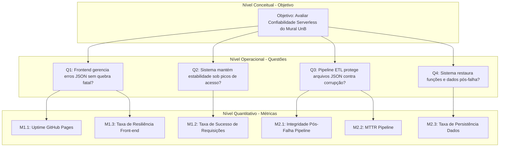

# Fase 2: Execução da Avaliação e Medições 

## Histórico de Versões

| Versão | Descrição                                                                                             | Autor  | Data       |
| ------ | ----------------------------------------------------------------------------------------------------- | ------ | ---------- |
| 1.1    | Estruturação inicial do GQM.                                                                          | Yogi   | 07/06/2026 |
| 1.2    | Inserção de métricas, plano de coleta e referências (ISO 25010:2023).                                 | Yogi   | 07/06/2026 |
| 1.3    | Reorganização lógica, ajuste de rastreabilidade e refinamento das hipóteses.                          | Yogi   | 07/06/2026 |
| 1.4    | Inserção de perguntas, hipóteses e métricas para o GQM                                                | Carlos | 09/06/2026 |
| 1.5    | Inserção de glossário, remoção do plano de coleta (vai para fase 3), melhora parte de rastreabilidade | Yogi   | 11/06/2026 |
| 1.6 | Adição do objetivo de avaliação de Tolerância a Falhas ao GQM | Guilherme Flyan | 12/06/2026
| 1.7 | Adição das questões e hipóteses sobre a Tolerância a Falhas | Guilherme Flyan | 12/06/2026
| 1.8 | Adição das métricas sobre a Tolerância a Falhas | Guilherme Flyan | 12/06/2026

## 1. Nível Conceitual: Objetivo de Medição (GQM)

O objetivo de medição orienta o foco da avaliação para a arquitetura _serverless_ do Mural UnB (React no GitHub Pages e ETL no GitHub Actions).

**Tabela 1: Definição do Objetivo GQM**

| Elemento GQM           | Definição no Contexto do Projeto                                     |
| ---------------------- | -------------------------------------------------------------------- |
| **Analisar**           | O sistema Mural UnB (frontend estático e pipeline de dados).         |
| **Com o propósito de** | Avaliar e diagnosticar falhas arquiteturais e interrupções de fluxo. |
| **Em relação à**       | Confiabilidade (Disponibilidade, Recuperabilidade e Tolerância a Falhas).                 |
| **Do ponto de vista**  | Da equipe avaliadora externa e dos usuários finais.                  |
| **No contexto do**     | Projeto da disciplina de Qualidade de Software 1 (FGA0315).          |

**Objetivo Explícito:** Avaliar a confiabilidade do produto de software para diagnosticar a disponibilidade da interface web, a recuperabilidade do pipeline de dados e a tolerância a falhas ao realizar web crawling ou chamadas a serviços externos como a API do Gemini, do ponto de vista de avaliadores externos e usuários, no contexto da disciplina de Qualidade de Software 1.

## 2. Nível Operacional: Questões e Hipóteses

### 2.1. Foco em Disponibilidade

- **Questão (Q1):** O frontend hospedado no GitHub Pages mantém-se operante e gerencia interrupções no carregamento dos dados JSON sem causar falha fatal (tela branca) para o usuário?
- **Hipótese (H1):** O serviço do GitHub Pages garantirá tempo de atividade superior a 99%. Falhas provocadas no carregamento assíncrono dos arquivos `.json` não quebrarão a interface por completo, assumindo que a aplicação React possui componentes nativos de tratamento visual de erros.

- **Questão (Q2):** O sistema é capaz de manter a operação estável e acessível mesmo sob picos de acesso, como em períodos de alta demanda?

- **Hipótese (H2):** Espera-se que a infraestrutura da API suporte uma carga de usuários simultâneos condizente com o volume de estudantes da UnB, mantendo o tempo de resposta dentro de limites aceitáveis e a taxa de sucesso das requisições próxima de 100%.

### 2.2. Foco em Recuperabilidade

- **Questão (Q3):** O pipeline automatizado (ETL) protege os arquivos JSON em produção contra corrupção e permite o rápido restabelecimento em caso de erro nos scripts Python?
- **Hipótese (H3):** Como os _workflows_ atuais (ex: `1_ejs_extrair_dados.yml`) utilizam `continue-on-error: true` e não possuem tratamento estrito de saída (`Exit 1`) em todos os passos, injetar erros críticos no Python resultará no apagamento acidental ou sobrescrita nula do JSON de produção. O tempo médio de recuperação (MTTR) histórico de falhas em _workflows_ será inferior a 24 horas.

- **Questão (Q4):** O sistema é capaz de restaurar suas funções e consistência de dados automaticamente ou com intervenção mínima após uma falha ou interrupção no serviço?
- **Hipótese (H4):** Espera-se que, em caso de queda do servidor ou erro crítico no banco de dados, o sistema consiga retomar as operações sem perda de dados significativos das oportunidades publicadas, e que o tempo necessário para o serviço voltar a ficar online seja reduzido

### 2.3. Foco em Tolerância a Falhas

- **Questão (Q5):** Qual é a eficácia do sistema (pipeline de dados) em tratar e controlar falhas críticas e graves de acordo com os testes já existentes?

- **Hipótese (H5):** Devido o Mural UnB ser uma aplicação que depende majoritariamente que seus dados estejam o máximo atualizados é necessário constância na extração de dados para que o sistema esteja atualizado regularmente, espera-se que os testes já estabelecidos encontrem falhas críticas e graves que inviabilizem o software de cumprir com seu o propósito.  

- **Questão (Q6):** Qual é a eficácia do sistema (pipeline de dados) em tratar e controlar falhas críticas e graves de acordo com a esteira CI/CD do projeto estabelecida através do Github Actions?

- **Hipótese (H6):** Espera-se encontrar falhas nos logs do GitHub Actions que envidenciem a contradição da cobertura de testes já estabelecidos com o real cenário da aplicação que é apresentado ao realizar o ETL do pipeline através das Actions do GitHub.

## 3. Nível Quantitativo: Seleção de Métricas

### 3.1. Métricas de Disponibilidade

- **M1.1 - Uptime do GitHub Pages:** Mede a estabilidade de acesso ao servidor hospedado.
- **Fórmula:** `Uptime = (Horas sem erros HTTP 4xx ou 5xx / Total de horas monitoradas) * 100`

- **M1.2 - Taxa de Sucesso de Requisições:** Mede a estabilidade de entrega de dados sob concorrência.
- **Fórmula:** `Taxa de Sucesso = (Requisições HTTP 2xx bem-sucedidas / Total de requisições enviadas sob carga) * 100`

- **M1.3 - Taxa de Resiliência da Interface Front-end:** Avalia a tolerância a falhas de rede do ecossistema React.
- **Fórmula:** `Resiliencia = (Simulações sem quebra catastrófica de DOM / Total de simulações de falha de rede) * 100`

### 3.2. Métricas de Recuperabilidade

- **M2.1 - Taxa de Integridade Pós-Falha do Pipeline:** Valida se o GitHub Actions bloqueia commits ou artefatos vazios.
- **Fórmula:** `Integridade = (Workflows abortados sem sobrescrever ou zerar o JSON / Total de falhas injetadas no ambiente) * 100`

- **M2.2 - Tempo Médio de Recuperação (MTTR):** Cronometra o tempo entre a falha identificada e a correção aplicada.
- **Fórmula:** `MTTR = Soma total em horas para correção de workflows quebrados / Total de quebras registradas no histórico`

- **M2.3 - Taxa de Persistência Pós-Falha:** Avalia a integridade e preservação dos registros públicos após restauração do sistema.
- **Fórmula:** `Persistencia = (Total de registros íntegros após recuperação / Total de registros antes da falha) * 100`

### 3.3. Tolerância a Falhas

- **M3.1 - Percentual de Prevenção de Falhas de Acordo com os Testes Existentes:** Representa o percentual de execução bem sucedida da suíte de testes existentes.
- **Fórmula:** `Prevenção de Falhas = (A / B) * 100`.

- **M3.2 - Percentual de Prevenção de Falhas de Acordo com o GitHub Actions:** Representa o percentual de execução bem sucedida das Actions do GitHub.
- **Fórmula:** `Prevenção de Falhas = (A / B) * 100`.

Onde em ambas as métricas:

`A = Número de ocorrências de falhas críticas e graves evitadas em relação aos casos de teste de padrão de falha`.

`B = Número de casos de teste de padrão de falha executados (quase causando falha) durante os testes`.

## 4. Hierarquia GQM

O Diagrama 1 ilustra a rastreabilidade entre o objetivo, as questões investigadas e as métricas adotadas.

**Diagrama 1: Desdobramento Hierárquico do Modelo GQM**

## 5. Níveis de Pontuação e Critérios de Julgamento

**Tabela 3: Critérios Detalhados de Julgamento**

| Métrica  | Inadequado | Satisfatório | Excelente | Justificativa do Critério de Julgamento / Recomendação                                                                                                                                                     |
| -------- | ---------- | ------------ | --------- | ---------------------------------------------------------------------------------------------------------------------------------------------------------------------------------------------------------- |
| **M1.1** | < 95%      | 95% - 98,9%  | **≥ 99%** | O limite de 99% segue o SLA padrão esperado para o GitHub Pages. Se abaixo de 95%, recomenda-se migrar o host para a Vercel.                                                                               |
| **M1.2** | < 98%      | 98% - 99,9%  | **100%**  | Como a aplicação serve arquivos estáticos leves, qualquer perda de requisições indica problemas na rede de entrega do GitHub. Recomendação: Otimizar requisições concorrentes.                             |
| **M1.3** | < 100%     | Não aceito   | **100%**  | Por ser uma Single Page Application, erros assíncronos não tratados geram tela branca (quebra de DOM). Exige-se comportamento binário rigoroso. Recomendação: Inserir _Error Boundaries_ no React.         |
| **M2.1** | < 100%     | Não aceito   | **100%**  | A integridade do arquivo de produção deve ser absoluta para evitar dados zerados em produção. Recomendação: Remover a flag `continue-on-error: true` dos passos críticos do arquivo YAML.                  |
| **M2.2** | > 48h      | 12h - 48h    | **< 12h** | O ciclo de atualização de oportunidades de estágio deve ser ágil. Demoras superiores a 48h desatualizam a plataforma. Recomendação: Acoplar alertas automatizados e refinar logs do Python.                |
| **M2.3** | < 100%     | Não aceito   | **100%**  | Falhas na execução do fluxo não podem comprometer ou apagar registros consolidados previamente. Exige-se persistência total. Recomendação: Implementar rotina automatizada de backup de segurança do JSON. |

## 6. Rastreabilidade

Esta seção valida formalmente a consistência do plano de métricas frente aos requisitos levantados na fase inicial do projeto.

**Tabela 4: Rastreabilidade de Requisitos Justificada**

| Requisito Priorizado (Fase 1) | Stakeholder Alvo                  | Subcaracterística | Métrica (Fase 2) | Justificativa do Alinhamento Coerente                                                                                                                                     |
| ----------------------------- | --------------------------------- | ----------------- | ---------------- | ------------------------------------------------------------------------------------------------------------------------------------------------------------------------- |
| Disponibilidade Geral         | Alunos da UnB                     | Disponibilidade   | M1.1, M1.2, M1.3 | Garante que o estudante acesse o painel sem interrupções de conexão do servidor (M1.1), mesmo sob alta concorrência (M1.2) e sem quebras visuais na aplicação web (M1.3). |
| Persistência e Integridade    | Administradores e Equipe de Dados | Recuperabilidade  | M2.1, M2.2, M2.3 | Assegura que falhas no fluxo automatizado não gerem perda de dados legados (M2.1), que o tempo de reparo seja mínimo (M2.2) e os dados permaneçam salvos (M2.3).          |

## 7. Glossário

- **Serverless:** Modelo de execução onde o provedor de nuvem gerencia a alocação de recursos de máquina sob demanda. No contexto do projeto, refere-se à dispensa de servidores dedicados por meio do uso do GitHub Pages e Actions.
- **Uptime:** Indicador do tempo de disponibilidade operacional contínua de um sistema computacional.
- **DOM (Document Object Model):** Interface de programação estrutural que representa as páginas web. Sua quebra impede a renderização de componentes visuais na tela.
- **ETL (Extract, Transform, Load):** Processo automatizado de engenharia de dados responsável por extrair informações de fontes externas, tratar a sua estrutura através de scripts e carregá-las no banco de dados final.
- **API (Application Programming Interface):** Conjunto de rotinas e padrões de programação que permite o tráfego de dados entre sistemas de software.
- **Persistência de Dados:** Capacidade de um sistema computacional de gravar dados em mídias físicas ou repositórios estáveis de forma que sobrevivam ao término ou falha do processo de software.

## 8. Declaração de Uso de IA

**Tabela 5: Declaração Formal de Uso de IA**

| Ferramenta | Tarefa Realizada                                                                               | Conferência Humana                                                                                         |
| ---------- | ---------------------------------------------------------------------------------------------- | ---------------------------------------------------------------------------------------------------------- |
| **Gemini 3.1 Pro ** | Template inicial, ajuste de terminologia, revisão ortográfica e organização lógica das seções. | A equipe validou todas as fórmulas e o alinhamento com a tabela de avaliação, removendo jargões genéricos. |

## 9. Referências Bibliográficas

1. **INTERNATIONAL ORGANIZATION FOR STANDARDIZATION.** _ISO/IEC 25010: Systems and software engineering — Systems and software Quality Requirements and Evaluation (SQuaRE) — Product quality model_. Genebra: ISO, 2023.
2. **BASILI, V. R.; CALDIERA, G.; ROMBACH, H. D.** _The Goal Question Metric Approach_. In: Encyclopedia of Software Engineering. New York: John Wiley & Sons, 1994. p. 528-532.
