# Relatório de Avaliação de Confiabilidade - Fase 4

## 1. Obtenção das Medidas e Dados Brutos

As medições foram executadas seguindo o Plano de Avaliação estabelecido na Fase 3. Os dados coletados refletem o comportamento real da arquitetura do Mural UnB sob testes de estresse, injeção de falhas e monitoramento passivo.

### 1.1 Evidências Visuais da Coleta (Screenshots)

#### M1.1 - Disponibilidade do Domínio (UptimeRobot)

*Descrição: Painel do UptimeRobot comprovando a disponibilidade contínua do domínio `muralunb.com.br`, com 100% de uptime registrado nas últimas 24 horas.*

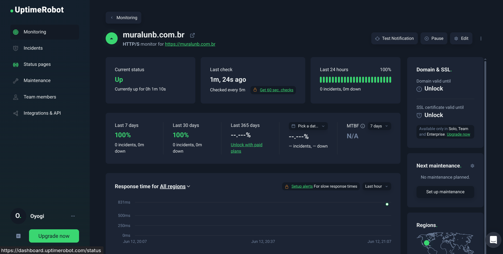

#### M1.2 - Teste de Carga e Estabilidade (Locust)

*Descrição: Interface do Locust exibindo 15.539 requisições totais durante o teste de estresse. Observa-se a falha integral (100%) no endpoint `/data/vagas.json` e bloqueios parciais na rota raiz `/`.*

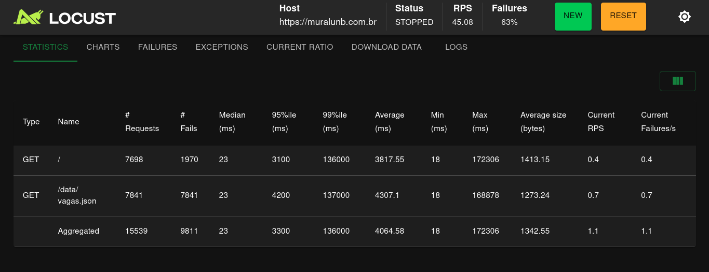

#### M1.3 - Resiliência do Frontend (Chrome DevTools)

*Descrição: Teste de bloqueio de rede via DevTools. A requisição de `oportunidades.json` foi bloqueada manualmente. A interface não colapsou em tela branca, renderizando o estado vazio ("Nenhuma oportunidade encontrada").*

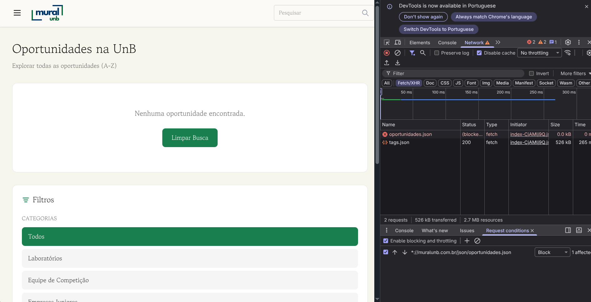

#### M2.1 - Injeção de Erro de Sintaxe no Pipeline

*Descrição: Injeção do código `import erro_proposital_teste` no script `extrair_empresas_juniores.py` diretamente no repositório para forçar a quebra da execução do ETL.*

.png)

#### M2.1 - Status dos Workflows após Injeção

*Descrição: Registro do GitHub Actions mostrando o fluxo "Processar Empresas Juniores" finalizando com status de sucesso verde ("Successful in 17s"), mascarando o erro real do Python devido à má configuração do arquivo `.yml`.*

.png)

#### M2.1 - Integridade do Repositório pós-falha

*Descrição: Comprovação da preservação dos dados de produção. Os arquivos `.json` na pasta `data/EJs/` não sofreram commits recentes (mantidos há 7 meses), confirmando que a falha não corrompeu os arquivos existentes.*

.png)

#### M2.2 - Histórico Geral de Execuções (Gargalo de Manutenção)

*Descrição: Visão geral das Actions, evidenciando o padrão cronológico de execuções com sucesso intercaladas com falhas sistemáticas no fluxo de laboratórios.*

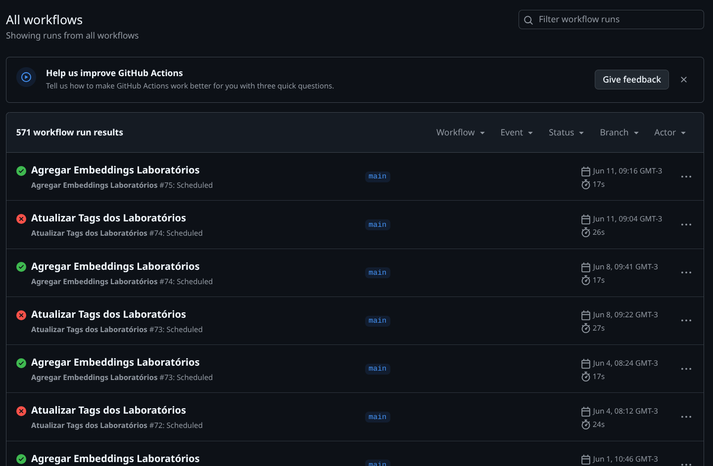

#### M2.2 - Histórico Filtrado de Falhas Crônicas

*Descrição: Filtro `is:failure` destacando falhas contínuas e não resolvidas do script "Atualizar Tags dos Laboratórios" ao longo de vários meses, impedindo o cálculo do MTTR e evidenciando abandono de manutenção.*

.png)

#### M2.3 - Teste de Persistência com Dados Corrompidos

*Descrição: Comprovação da inserção da exceção intencional (`raise Exception("Erro forçado...")`) no script de consolidação e a consequente falha correta do workflow no Actions (exit code 1), garantindo que os 83 registros previamente estabelecidos não fossem apagados.*

.png)

#### M3.1 - Percentual de Prevenção de Falhas de Acordo com os Testes Existentes

*Descrição: Obtenção dos dados A (testes que passaram) e B (total de testes executados) conforme definidos na fase 3.*

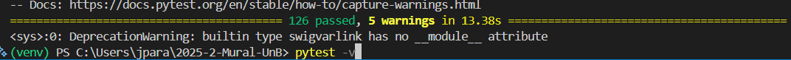 Dados A

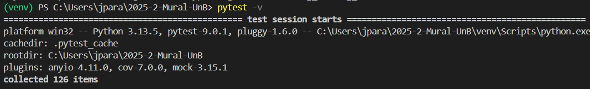 Dados B

#### M3.2 - Percentual de Prevenção de Falhas de Acordo com o GitHub Actions

*Descrição: Obtenção dos dados A (últimas actions scheduled que foram executadas de maneira bem sucedida) e B (total de actions scheduled executados) conforme definidos na fase 3.*

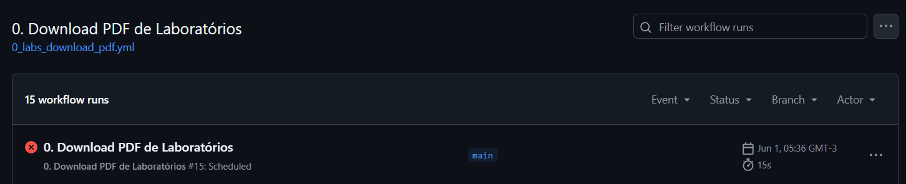

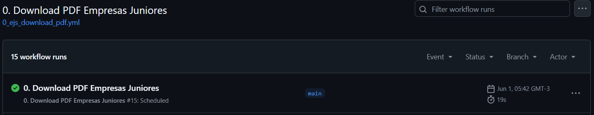

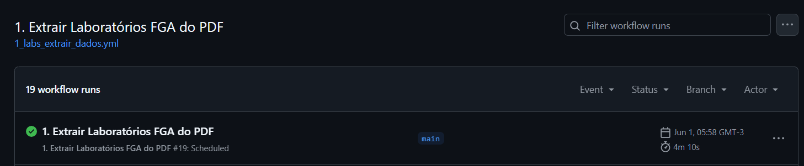

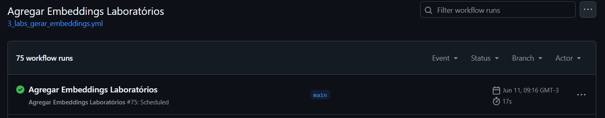

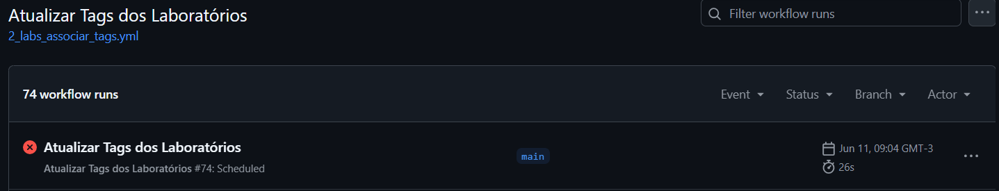

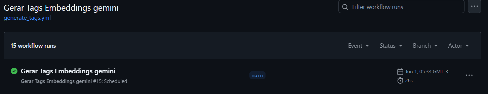

---

## 2. Processamento de Dados e Níveis de Pontuação

Os dados brutos coletados foram aplicados às fórmulas matemáticas definidas no modelo GQM para determinar o nível de maturidade de cada indicador.

### Tabela 1: Consolidação das Métricas e Julgamento de Nível

| Métrica | Característica | Cálculo / Cenário Observado | Nível de Pontuação (Fase 2) |
| --- | --- | --- | --- |
| **M1.1** | Disponibilidade | $100\%$ de uptime registrado nas últimas 24 horas. | **Excelente** |
| **M1.2** | Estabilidade | $\left(\frac{5.728 \text{ (Sucessos)}}{15.539 \text{ (Total)}}\right) \times 100 = 36,86\%$ | **Inadequado** |
| **M1.3** | Resiliência Front | $0\%$ de quebra de DOM / Mensagem amigável renderizada em $5/5$ testes. | **Excelente** |
| **M2.1** | Integridade Pipeline | Sistema abortou antes da gravação. $0$ bytes corrompidos em produção. | **Excelente** |
| **M2.2** | Recuperação (MTTR) | Erro persistente há $> 3$ meses. Sem aplicação de correção definitiva. | **Inadequado** |
| **M2.3** | Persistência | $\left(\frac{83 \text{ (Pós-falha)}}{83 \text{ (Pré-falha)}}\right) \times 100 = 100\%$ de retenção de registros. | **Excelente** |
| **M3.1** | Tolerância a Falhas | $126 / 126 * 100 = 100\%$ de execução de testes bem sucedidos. | **Excelente** |
| **M3.2** | Tolerância a Falhas | $ 4 / 6 * 100 = 66.66\%$ de execução de actions bem sucedidos. | **Inadequado** |

---

## 3. Análise GQM e Julgamento das Hipóteses

### Q1: A interface se mantém disponível perante falhas assíncronas?

* **Julgamento:** Parcialmente Adequado.
* **Análise:** O site hospedado no GitHub Pages possui excelente disponibilidade de infraestrutura base (M1.1 = 100%). Perante a ausência do arquivo de dados principal (`oportunidades.json`), o ecossistema React (M1.3) provou-se resiliente contra travamentos críticos (quebra de DOM/tela branca), renderizando com sucesso um estado vazio (*empty state*). Contudo, a usabilidade é prejudicada, pois o usuário recebe a mensagem falsa de que "não há oportunidades cadastradas" em vez de um aviso de erro de rede.

### Q2: O sistema suporta picos de tráfego sem degradação?

* **Julgamento:** **Vulnerável / Hipótese Refutada**.
* **Análise:** A rota principal (`/`) suportou parte do tráfego, mas sofreu descarte de conexões com 1.970 falhas. O endpoint de dados estáticos (`/data/vagas.json`) apresentou **colapso de 100%**, falhando em todas as 7.841 tentativas. A infraestrutura de hospedagem atual restringe ativamente requisições sequenciais originadas do mesmo IP (mecanismo de Rate Limiting ou proteção DDoS implícita), impossibilitando o funcionamento do sistema sob estresse severo de acessos simultâneos.

### Q3: O pipeline protege os dados em caso de falha de script e é corrigido rapidamente?

* **Julgamento:** **Inadequado / Hipótese Refutada**.
* **Análise:** O isolamento cumpre o papel de proteção passiva (M2.1 = 100%). Os scripts Python quebram antes de invocar comandos de sobrescrita destrutiva, mantendo a base de produção segura. No entanto, a premissa de correção rápida em menos de 24 horas falhou completamente. O workflow agendado de laboratórios está quebrado de forma ininterrupta desde 2 de abril de 2026, evidenciando ausência de monitoramento por parte da equipe de engenharia.

### Q4: A restauração pós-falha garante a consistência dos registros válidos?

* **Julgamento:** Adequado.
* **Análise:** O isolamento e o comportamento atômico do pipeline garantem que erros em dados novos ou malformados não corrompam os dados estáveis preexistentes. O arquivo consolidou 100% de persistência (83/83 registros mantidos sem perdas), mitigando o efeito cascata de um carregamento falho (M2.3).

### Q5: Qual é a eficácia do sistema (pipeline de dados) em tratar e controlar falhas críticas e graves de acordo com os testes já existentes?

* **Julgamento:** **Adequado PORÉM Hipótese Refutada**.
* **Análise:** A cobertura dos testes está ótima entretanto como foi evidenciado pela métrica 3.2 existem códigos que sequer executam nos serviços agendados do GitHub Actions onde os logs apresentam falhas na tentativa de execução de scripts que não são identificados através da execução dos testes manuais, isso acarreta na má adequação e aplicabilidade dos testes caracterizando a qualidade dos mesmos como inadequada onde exploram apenas o cenário feliz de execução do código e não lidam com falhas críticas/graves.

### Q6: Qual é a eficácia do sistema (pipeline de dados) em tratar e controlar falhas críticas e graves de acordo com a esteira CI/CD do projeto estabelecida através do Github Actions?

* **Julgamento:** Adequado.
* **Análise:** Através dos logs do Github Actions foi possível evidenciar a existencia de falhas críticas e graves que comprometem o cumprimento do software com seu propósito.

---

## 4. Conclusão e Plano de Ação

A avaliação de confiabilidade do Mural UnB expôs uma arquitetura robusta em sua integridade de dados estáticos, mas frágil em aspectos operacionais sob estresse e manutenção corretiva. O pipeline mascara quebras de execução devido à diretiva `continue-on-error: true` no arquivo `.yml`, gerando logs com falso status de "Successful" para execuções que falharam internamente.

Para elevar o nível de confiabilidade do sistema, a equipe de desenvolvimento deve executar as seguintes ações:

1. **Remoção de Máscaras de Logs (Severidade Alta):** Excluir a configuração `continue-on-error: true` dos workflows `.github/workflows/1_ejs_extrair_dados.yml` e equivalentes. Falhas no script de extração devem interromper o job do GitHub Actions de forma explícita para alertar os mantenedores.
2. **Mitigação do Bloqueio de Carga (Severidade Alta):** Posicionar uma camada de CDN (ex: Cloudflare) à frente do domínio `muralunb.com.br`. O cacheamento do arquivo JSON na borda (*edge*) evitará o bloqueio por Rate Limiting do servidor de origem, absorvendo as requisições simultâneas constatadas no teste do Locust.
3. **Resolução de Erros Crônicos (Severidade Média):** Corrigir o script associado ao workflow `Atualizar Tags dos Laboratórios`, paralisado desde abril de 2026, restabelecendo a atualização automatizada da plataforma.
4. **Tratamento de Exceções de Rede no Front (Severidade Baixa):** Ajustar o componente de erro do React para diferenciar um arquivo JSON vazio (sem vagas) de uma requisição bloqueada por HTTP 4xx/5xx, exibindo um alerta claro de "Erro de conexão" para o usuário final.
5. **Desenvolvimento de Testes**: O desenvolvimento de novos testes é bastante adequado visando explorar falha críticas e graves para que a aplicação possa cumprir com seu propósito.